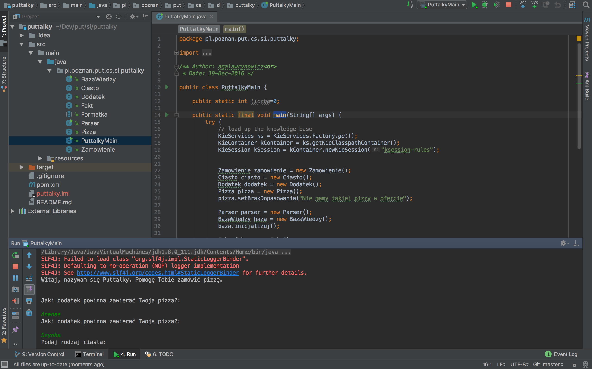

# Jak uruchomić PUTtalky?
## IntelliJ IDEA 2016.3
1. *Import project*
2. Wskazać katalog puttalky
3. *Import project from external model -> Maven*
4. Zostawić wybrane pola i dodatkowo wybrać *Import Maven projects automatically*
5. Zaznaczyć wszystkie projekty Maven (*pl.poznan.put.cs.ai.puttalky:1.0-SNAPSHOT*)
6. Upewnić się, że wybrano najnowszą wersję JDK
7. Po zakończeniu indeksowania należy wybrać po lewej stronie okna w drzewie projektu package *src/main/java/pl.poznan.put.cs.si.puttalky* i klasę *PuttalkyMain*,
8. Uruchomić metodę *main* klikając zieloną ikonę play lub używając skrótu klawiszowego(OS X: ctrl+shift+r, Linux/Win: ctrl+shift+f10)
9. Poprawnie uruchomiony program powinien wyglądać jak na screenshocie poniżej:

## NetBeans 8.2
1. *File*->*Open Project*
2. Wskazać katalog z plikiem `pom.xml`
3. *Run*->*Run Project (puttalky)*
4. W oknie *Select Main Class for Execution* wskazać `pl.poznan.put.cs.si.puttalky.PuttalkyMain`
5. Kliknąć *Select Main Class*

Jeśli na liście *Select Main Class* nie pojawiają się żadne elementy,
należy najpierw odpalić budowanie Mavenem, np.:
Prawym na projekt ->*Build with Dependencies*

## Eclipse Neon
1. *File*->*Import*->*Maven*->*Existing Maven Project*
2. *Browse*
2. Wskazać katalog z plikiem `pom.xml`
3. *Finish*
4. Prawym na `puttalky`
5. *Run As* -> *Java Application*
6. Wskazać `PuttalkyMain` z pakietu `pl.poznan.put.cs.si.puttalky`
7. Kliknąć *OK*

## Wiersz poleceń
1. Przejść do katalogu ze źródłami
2. `mvn package`
3. `java -jar target/puttalky-1.0-SNAPSHOT.jar`
