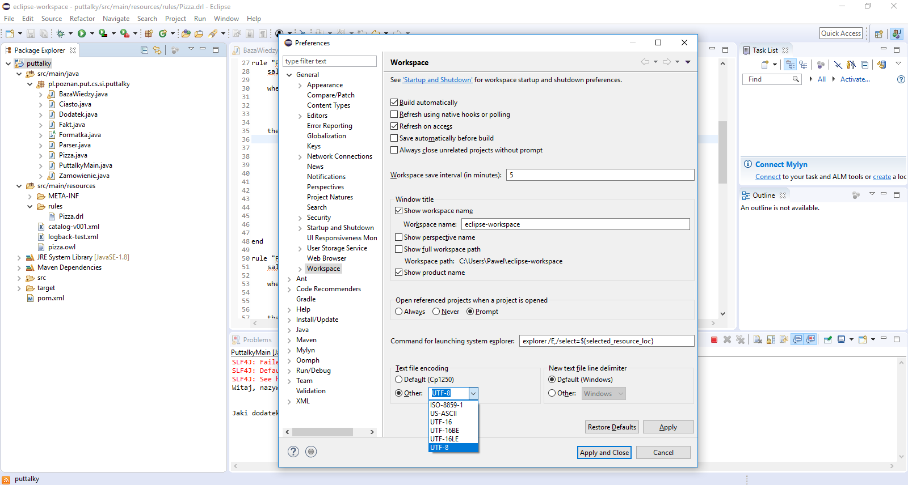

# Jak uruchomić PUTtalky?
## IntelliJ IDEA 2016.3/IntelliJ IDEA 2017.3
1. *Import project*
2. Wskazać katalog puttalky
3. *Import project from external model -> Maven*
4. Zostawić wybrane pola i dodatkowo wybrać *Import Maven projects automatically*
5. Zaznaczyć wszystkie projekty Maven (*pl.poznan.put.cs.ai.puttalky:1.0-SNAPSHOT*)
6. Upewnić się, że wybrano najnowszą wersję JDK
7. Po zakończeniu indeksowania należy wybrać po lewej stronie okna w drzewie projektu package *src/main/java/pl.poznan.put.cs.si.puttalky* i klasę *PuttalkyMain*,
8. Uruchomić metodę *main* klikając zieloną ikonę play lub używając skrótu klawiszowego(OS X: ctrl+shift+r, Linux/Win: ctrl+shift+f10)
9. Poprawnie uruchomiony program powinien wyglądać jak na screenshocie poniżej:

## NetBeans 8.2
1. *File*->*Open Project*
2. Wskazać katalog z plikiem `pom.xml`
3. *Run*->*Run Project (puttalky)*
4. W oknie *Select Main Class for Execution* wskazać `pl.poznan.put.cs.si.puttalky.PuttalkyMain`
5. Kliknąć *Select Main Class*
\

Jeśli na liście *Select Main Class* nie pojawiają się żadne elementy,
należy najpierw odpalić budowanie Mavenem, np.:
Prawym na projekt ->*Build with Dependencies*

**Uwaga:** NetBeans 8.2 nie współpracuje poprawnie z JDK 1.9. Ponadto mogą wystąpić problemy z polskimi znakami. Aby naprawić te błędy należy doinstalować starszą wersję JDK (np. 1.8), odszukać plik konfiguracyjny Netbeans, który znajdziemy w `katalog_domowy_netbeans\etc\netbeans.conf` (np. `C:\Program Files\NetBeans 8.2\etc\netbeans.conf`), a następnie dokonać w nim dwóch zmian:
* w linii `netbeans_default_options="...."` dopisać frazę `-J-Dfile.encoding=UTF-8` (przykład: `netbeans_default_options="-J-Dfile.encoding=UTF-8 -J-client -J-Xss2m -J-Xms32m -J-Dapple.laf.useScreenMenuBar=true -J-Dapple.awt.graphics.UseQuartz=true -J-Dsun.java2d.noddraw=true -J-Dsun.java2d.dpiaware=true -J-Dsun.zip.disableMemoryMapping=true")`
* w lini `netbeans_jdkhome="..."` zmieniamy folder jdk na 1.8 (przykład:`netbeans_jdkhome="C:\Program Files\Java\jdk1.8.0_151"`)

## Eclipse Neon/Eclipse Oxygen
1. *File*->*Import*->*Maven*->*Existing Maven Project*
2. *Browse*
2. Wskazać katalog z plikiem `pom.xml`
3. *Finish*
4. Prawym na `puttalky`
5. *Run As* -> *Java Application*
6. Wskazać `PuttalkyMain` z pakietu `pl.poznan.put.cs.si.puttalky`
7. Kliknąć *OK*

**Uwaga:** Mogą wystąpić problemy z polskimi znakami. Należy wtedy wejść w Window -> Preferences -> General -> Workspace a sekcji Text file encoding zaznaczyć Other i wybrać UTF-8.

## Wiersz poleceń
1. Przejść do katalogu ze źródłami
2. `mvn package`
3. `java -jar target/puttalky-1.0-SNAPSHOT.jar`

**Uwaga:** W systemie Windows mogą wystąpić problemy z polskimi znakami. Należy wtedy wprowadzić do cmd polecenie `chcp 65001`.
